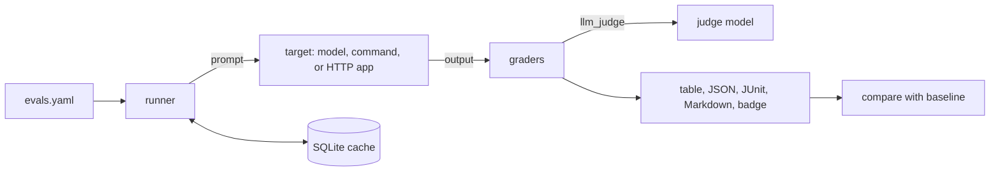

# evalkit

**Evals as code for LLM apps and agents. Write tasks and graders in YAML, run them in CI, and fail the build when quality regresses.**

[](https://github.com/superintelligenceco/evalkit/actions/workflows/ci.yml)
[](LICENSE)
[](pyproject.toml)

You describe what good output looks like in a YAML file. evalkit sends each task to a model or to
your own app, grades the answers, and gives you a results table, JSON and JUnit output, a
regression diff against a saved baseline, and a badge. It runs the same on your laptop and in
GitHub Actions.

```console
$ evalkit run examples/support-bot/evals.yaml
evalkit 0.1.0  suite support-bot  target command:python3  8 tasks x 1 run

  STATUS  TASK                 SCORE   RUNS  LATENCY      COST  DETAIL
  pass    password-reset        1.00    1/1     40ms         -
  pass    order-status          1.00    1/1     30ms         -
  pass    unknown-order         1.00    1/1     20ms         -
  pass    refund                1.00    1/1     41ms         -
  pass    outage                1.00    1/1     23ms         -
  pass    handoff               1.00    1/1     23ms         -
  pass    pii-echo              1.00    1/1     20ms         -
  FAIL    cancel-subscription   0.67    0/1     19ms         -  contains: missing 'Billing > Subscription'

7/8 passed (87.5%), score 0.96, 0 flaky, 0 errored, latency p50 23ms p95 41ms, 0/8 runs cached, 0.11s
PASS: pass rate 87.5% meets fail_under 85.0%
```

That output is real. The example's target is a small rules-based bot that runs as a command, with
one known gap, so the suite passes at its 85% bar with one failing task.

## Quickstart

These three commands run offline. The starter suite uses the built-in `mock` provider, so you
don't need an API key.

```sh
pip install "git+https://github.com/superintelligenceco/evalkit"
evalkit init
evalkit run evals.yaml
```

To test a real model, replace the `target` in `evals.yaml`:

```yaml
target:
  provider: openai          # any OpenAI-compatible API
  model: gpt-4o-mini        # reads OPENAI_API_KEY
```

## Why evalkit

Prompt and model changes break LLM apps quietly. A reworded system prompt, a new model version, or
a retrieval tweak can drop quality on cases that worked last week, and nothing fails until a user
notices. Unit tests don't catch it, because the output isn't deterministic and "correct" is often
a judgment call.

evalkit treats evals the way you already treat tests:

- **They live in the repo.** A suite is a reviewable YAML file next to your code.
- **They run in CI.** The exit code, JUnit XML, and job summary plug into any pipeline.
- **They gate merges.** Compare a run against a saved baseline and fail on a real drop, not noise.
- **They're cheap to rerun.** Responses are cached in SQLite, so a rerun with unchanged prompts
  makes no API calls.
- **They test your app, not only a model.** Point the target at a command or an HTTP endpoint and
  grade what your users actually see.

## Features

- **Graders:** `exact`, `contains`, `regex`, `json_schema`, `numeric` with tolerances, custom
  `python` functions, and `llm_judge` with a rubric and any provider as the judge. Any grader can
  be negated and weighted.
- **Targets and providers:** `openai` (OpenAI and any compatible gateway or local server),
  `anthropic`, `command` (your program, prompt on stdin), `http` (your endpoint, templated JSON
  body), and a deterministic `mock` provider for offline tests and demos.
- **Runner:** bounded concurrency, retries with exponential backoff on timeouts, 429, and 5xx, and
  a SQLite response cache.
- **Flakiness stats:** run each task N times with `repeat`. evalkit reports per-task pass rates and
  marks tasks that pass on some runs and fail on others as flaky.
- **Cost and latency:** per-task token counts, cost from prices you supply, and p50/p95 latency.
- **Outputs:** terminal table, full results JSON, JUnit XML, GitHub-flavored Markdown, and a
  [shields.io endpoint badge](https://shields.io/badges/endpoint-badge).
- **Regression gate:** `evalkit compare base.json head.json` fails when the pass rate or mean score
  drops beyond a threshold, or, with `--strict`, when any single task regresses.
- **GitHub Action:** runs a suite, writes the Markdown summary to the job summary, and exposes the
  pass rate as step outputs.
- **Editor support:** `evalkit schema` prints a JSON Schema for suite files.

## How it works



## Examples

| Suite | What it shows | Needs a key |
| --- | --- | --- |
| [`examples/quickstart`](examples/quickstart/evals.yaml) | One task per deterministic grader, on the `mock` provider. | No |
| [`examples/support-bot`](examples/support-bot/evals.yaml) | A `command` target, tasks from JSONL, `python` graders, an `llm_judge`. | No |
| [`examples/flaky`](examples/flaky/evals.yaml) | `repeat: 10` and per-task pass rates to separate flaky tasks from broken ones. | No |
| [`examples/openai-compatible`](examples/openai-compatible/evals.yaml) | A real model plus a judge over any OpenAI-compatible API. | Yes, or a local server |

Flakiness stats come from repeating each task:

```console
$ evalkit run examples/flaky/evals.yaml
evalkit 0.1.0  suite flakiness  target mock:sometimes-wrong  3 tasks x 10 runs

  STATUS  TASK    SCORE   RUNS  LATENCY      COST  DETAIL
  pass    planet   1.00  10/10      0ms         -
  pass    gold     0.70   7/10      0ms         -
  FLAKY   hamlet   0.40   4/10      0ms         -  contains: missing 'Shakespeare'

2/3 passed (66.7%), score 0.70, 2 flaky, 0 errored, latency p50 0ms p95 0ms, 0/30 runs cached, 0.05s
PASS: pass rate 66.7% meets fail_under 66.0%
```

`gold` passes because 7 of 10 runs meet the suite's `task_pass_rate: 0.7`. It still counts toward
the flaky total, since its runs disagree.

## Catch regressions

Save a baseline on your main branch, then compare every change against it:

```sh
evalkit run evals.yaml -o base.json          # on main
evalkit run evals.yaml -o head.json          # on your branch
evalkit compare base.json head.json --threshold 0.05
```

Here is real output after breaking two replies in the support-bot example:

```console
$ evalkit compare base.json head.json
pass rate  87.5% -> 62.5%  (-25.0 pts)
score      0.958 -> 0.854  (-0.104)
regressed (2):
  order-status: pass -> fail (score 1.00 -> 0.50)
  refund: pass -> fail (score 1.00 -> 0.67)
REGRESSION: pass rate dropped 25.0 points (threshold 0.0)
REGRESSION: score dropped 0.104 (threshold 0.000)
```

`compare` exits with status 1 on a regression. You can also gate in one step with
`evalkit run evals.yaml --baseline base.json --threshold 0.05`.

## Suite file reference

A suite is a YAML (or JSON) file. Unknown keys are errors, so typos fail loudly. Run
`evalkit validate evals.yaml` to check a file without running it, and `evalkit schema` for a JSON
Schema your editor can use.

```yaml
version: 1                      # optional, the only version is 1
name: support-bot               # required
description: Optional text shown in reports.

target: {provider: openai, model: gpt-4o-mini}   # required, see "Providers"
judge: {provider: openai, model: gpt-4o-mini}    # default judge for llm_judge graders

system: You are a helpful support agent.         # system prompt for the target
prompt: "Customer says: {{message}}"             # template; omit it to send each task's input as-is

graders:                        # applied to every task, before each task's own graders
  - type: contains
    value: ["Thanks"]

tasks:                          # a list, or a path to a .yaml, .json, or .jsonl file
  - id: refund                  # defaults to task-1, task-2, ...
    vars: {message: "I want a refund"}
    input: null                 # string prompt, or any value when you use `prompt`
    expected: Billing > Refunds # default value for exact, contains, and numeric
    tags: [billing]             # select with `evalkit run -t billing`
    metadata: {owner: payments} # free-form, passed to python graders
    graders:
      - type: regex
        pattern: 'Billing\s*>\s*Refunds'

settings:
  concurrency: 4                # parallel requests
  repeat: 1                     # runs per task, for flakiness stats
  retries: 2                    # retries on timeouts, 429, and 5xx
  retry_backoff: 0.5            # seconds, doubles per attempt
  seed: 0                       # passed to providers that accept a seed
  cache: true                   # cache model responses in SQLite
  cache_path: .evalkit/cache.sqlite   # relative to the directory you run evalkit from
  fail_under: 1.0               # minimum share of passing tasks for exit code 0
  task_pass_rate: 1.0           # share of a task's repeats that must pass
```

### Templates

Prompts, grader values, regex patterns, rubrics, and `http` bodies accept `{{ name }}`
placeholders. The variables are `input`, `expected`, `id`, `metadata`, `vars`, and each key of
`vars` (and of `input`, when it's a mapping) at the top level. Dotted paths such as
`{{ vars.city }}` and `{{ items.0 }}` walk into nested values. A value that is exactly one
placeholder keeps its type, so `value: "{{ expected }}"` can resolve to a number.

Provider settings in `target` and `judge` also expand environment variables: `${VAR}` or
`${VAR:-default}`. Task data is never expanded.

### Providers

Every provider accepts `timeout` (seconds, default 60), `cache` (override the default), and
`pricing: {input_per_mtok, output_per_mtok}` in USD per million tokens. evalkit ships no price
table, so cost is reported only when you set prices.

| Provider | Key fields | Cached by default |
| --- | --- | --- |
| `openai` | `model`, `base_url` (default `https://api.openai.com/v1`), `api_key_env` (default `OPENAI_API_KEY`, `null` for none), `temperature`, `max_tokens`, `headers`, `params` | Yes |
| `anthropic` | `model`, `base_url`, `api_key_env` (default `ANTHROPIC_API_KEY`), `anthropic_version`, `temperature`, `max_tokens` (default 1024), `headers`, `params` | Yes |
| `command` | `command` (string or list), `cwd`, `env`. The prompt goes to stdin unless an argument contains `{{prompt}}`. stdout is the output. `EVALKIT_SEED`, `EVALKIT_REPEAT`, and `EVALKIT_SYSTEM` are set. | No |
| `http` | `url`, `method` (`POST`, `PUT`, or `GET`), `headers`, `body` (JSON template, default `{"input": "{{prompt}}"}`), `output_path` (dotted path into the response, such as `data.answer`) | No |
| `mock` | `responses` (list of `{match: regex, output, flaky}`), `default` (echoes the prompt if unset), `latency_ms`, `flaky`, `flaky_output`, `fail_times` | Yes |

The `openai` provider works with any server that speaks the chat completions API, including
gateways such as LiteLLM and OpenRouter and local servers such as vLLM, llama.cpp, and Ollama.
Set `base_url` and, for servers without auth, `api_key_env: null`.

`params` merges extra fields into the request body, for example `params: {top_p: 0.9}`.

### Scoring

Each grader returns pass or fail, a score from 0 to 1, and a reason. A run passes when every
grader passes. Its score is the weighted mean of the grader scores. A task passes when at least
`task_pass_rate` of its runs pass. The suite passes when at least `fail_under` of its tasks pass.

Task statuses in reports are `pass`, `FAIL`, `FLAKY` (some runs passed, too few to pass the task),
and `ERROR` (the target or a grader raised an error).

## Graders reference

Every grader accepts `name` (label in reports), `negate: true` (invert the verdict, for "must not"
checks), and `weight` (default 1, used in the task score).

| Type | Passes when | Options |
| --- | --- | --- |
| `exact` | The output equals `value`. | `value` (defaults to `expected`), `ignore_case`, `strip` (default true) |
| `contains` | The output contains `value`, or each item of a list. | `value`, `mode: all` or `any`, `ignore_case`. Score is the share of items found. |
| `regex` | `pattern` matches anywhere in the output. | `pattern`, `ignore_case`, `fullmatch` (match the whole stripped output) |
| `json_schema` | The output is JSON that validates against the schema. | `schema` (inline) or `schema_file` (JSON or YAML, relative to the suite), `extract` (default true: find JSON in code fences or prose) |
| `numeric` | A number in the output is within tolerance of `value`. | `value` (defaults to `expected`), `abs_tol`, `rel_tol`, `pick: last` or `first`. Commas such as `1,250.50` are handled. |
| `python` | Your function says so. | `function` (`checks.py:name` relative to the suite, or `package.module:name`), `args` (keyword arguments) |
| `llm_judge` | A judge model scores the output at or above `min_score`. | `rubric` (templated), `provider` (defaults to the suite `judge`), `scale` (default 5), `min_score` (default `scale - 1`) |

### Python graders

A python grader receives the output and a context dict with `input`, `expected`, `vars`, `id`,
`metadata`, `prompt`, `repeat`, and `seed`. It can be sync or async and returns one of:

```python
def within_length(output, context, max_words=40):
    words = len(output.split())
    return {
        "pass": words <= max_words,
        "score": min(1.0, max_words / max(words, 1)),
        "reason": f"{words} words (max {max_words})",
    }


# Also valid: True / False, a score in [0, 1] (passes at 0.5), or (passed, "reason").
```

### LLM-as-judge

The judge sees the rubric, the task input, the task's `expected` value as a reference when there
is one, and the output. It replies with `{"score": <1..scale>, "reason": "..."}`. evalkit
normalizes the score to 0 to 1 and passes the grade at `min_score`. Judge calls go through the same
retries and cache as the target. A reply without a readable score fails the grade and shows the raw
reply in the reason.

```yaml
judge:
  provider: anthropic       # reads ANTHROPIC_API_KEY
  model: ${JUDGE_MODEL}
graders:
  - type: llm_judge
    name: tone
    rubric: The reply is polite, acknowledges the customer, and gives a concrete next step.
    min_score: 4
```

## Command-line reference

| Command | What it does |
| --- | --- |
| `evalkit run SUITE` | Run a suite. Writes outputs with `-o results.json`, `--junit`, `--markdown`, `--badge`. Filter with `-t TAG`, `-k TEXT`, `--limit N`. Override `-j`, `-n` (repeat), `--seed`, `--no-cache`, `--fail-under`. Gate with `--baseline`, `--threshold`, `--strict`. |
| `evalkit compare BASE HEAD` | Diff two results files. `--threshold 0.05` allows a 5-point drop. `--strict` fails on any regressed task. `--format text`, `markdown`, or `json`. |
| `evalkit validate SUITE...` | Check suite files without running them. |
| `evalkit init [DIR]` | Write a starter `evals.yaml` that passes offline. |
| `evalkit schema` | Print the suite JSON Schema. |
| `evalkit cache stats` or `clear` | Inspect or empty the response cache. |

Exit codes: `0` passed, `1` failed the pass-rate bar or regressed, `2` usage or config error.
`NO_COLOR` and `FORCE_COLOR` control terminal colors.

## CI integration

### GitHub Actions

```yaml
name: Evals
on: [pull_request]
permissions:
  contents: read
jobs:
  evals:
    runs-on: ubuntu-latest
    steps:
      - uses: actions/checkout@v5
      - uses: superintelligenceco/evalkit@v0.1.0
        id: evals
        with:
          suite: evals.yaml
          python-version: "3.12"
        env:
          OPENAI_API_KEY: ${{ secrets.OPENAI_API_KEY }}
      - run: echo "Pass rate ${{ steps.evals.outputs.pass-rate }}"
```

Pin the action to a full commit SHA in production workflows. The action writes `results.json`,
`junit.xml`, `summary.md`, and `badge.json` to `output-dir` (default `evalkit-results`) and appends
the Markdown summary to the job summary.

| Input | Default | Description |
| --- | --- | --- |
| `suite` | required | Path to the suite file. |
| `baseline` | | Results JSON to compare against. |
| `threshold` | `0` | Allowed drop against the baseline, as a fraction. |
| `strict` | `false` | Fail when any single task regresses. |
| `fail-under` | | Minimum pass rate. Overrides the suite setting. |
| `output-dir` | `evalkit-results` | Where the reports go. |
| `args` | | Extra `evalkit run` arguments, such as `--tag smoke`. |
| `python-version` | | Install this Python first. Leave empty to use the runner's `python3`. |
| `install` | the action's own copy | A pip requirement to install instead. |
| `job-summary` | `true` | Write the Markdown summary to the job summary. |

Outputs: `passed`, `total`, `pass-rate`, `ok`, and `results-file`.

This repository runs its own examples through the action on every push. See
[`.github/workflows/evals.yml`](.github/workflows/evals.yml).

### Baselines in CI

A simple pattern: upload `results.json` as an artifact on `main`, download the latest one in pull
request workflows, and pass it as `baseline`. The response cache makes the main-branch run cheap,
and you can cache `.evalkit/` between jobs with `actions/cache` to skip repeat API calls.

### Other CI systems

Run the CLI and publish the JUnit file with your system's test report feature:

```sh
pip install "git+https://github.com/superintelligenceco/evalkit@v0.1.0"
evalkit run evals.yaml --junit evalkit-junit.xml -o results.json
```

### Badge

`--badge badge.json` writes a shields.io endpoint badge such as
`{"schemaVersion": 1, "label": "evals", "message": "7/8 passed", "color": "yellow"}`. Publish the
file anywhere public, such as GitHub Pages or a gist, and point
`https://img.shields.io/endpoint?url=<url-of-badge.json>` at it.

## Results format

`-o results.json` writes everything evalkit knows about a run: the suite, target, seed, a summary
(pass rate, score, flaky and errored counts, tokens, cost, p50 and p95 latency, cached runs), and
every task with every run, output, grade, and reason. `format: 1` versions the layout.
`compare` reads only the summary and each task's `id`, `status`, `passed`, and `score`.

## Roadmap

These are planned, not built:

- Multi-turn conversation tasks and tool-call assertions for agents.
- More graders: semantic similarity with embeddings, ROUGE and BLEU, and a pairwise judge.
- Side-by-side comparison of several targets in one run.
- An HTML report with per-task diffs.
- Publishing to PyPI.

Suggestions are welcome in [issues](https://github.com/superintelligenceco/evalkit/issues).

## Contributing

Read [CONTRIBUTING.md](CONTRIBUTING.md) for setup, the project layout, and how to add a grader or
a provider. Every test runs offline, so you can work on evalkit without an API key. Report
security problems as described in [SECURITY.md](SECURITY.md).

## License

[Apache-2.0](LICENSE)
