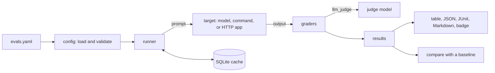
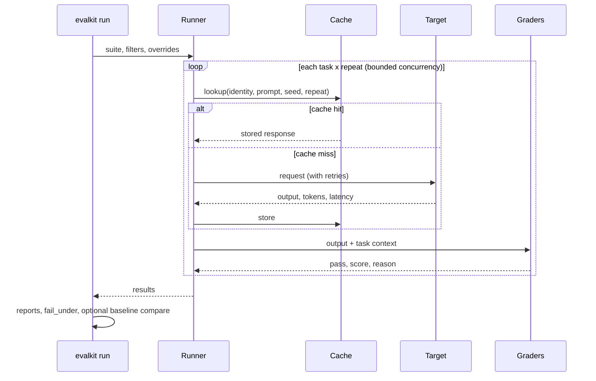

# Architecture

evalkit is a small, single-process Python package. The command line loads a suite, the runner
fans the tasks out to the target with bounded concurrency, the graders score each output, and the
report layer renders the results.

## Modules

| Module | Role |
| --- | --- |
| `evalkit.config` | Pydantic models for the suite file, the YAML and JSON loader, `${VAR}` expansion in provider settings, and the JSON Schema. Unknown keys are errors. |
| `evalkit.templating` | `{{ name }}` placeholders with dotted paths. A value that's exactly one placeholder keeps its type. |
| `evalkit.providers` | One class per target: `openai`, `anthropic`, `command`, `http`, and `mock`. Each exposes an `identity()` for the cache key and raises a retriable error on timeouts, 429, and 5xx. |
| `evalkit.runner` | Runs every task and repeat on an asyncio event loop behind a semaphore, retries with exponential backoff, and reads and writes the cache. |
| `evalkit.cache` | SQLite key-value store. The key hashes the provider identity, prompt, system prompt, seed, and repeat index. |
| `evalkit.graders` | Deterministic graders in `builtin.py`, the rubric judge in `judge.py`, and loading of your `python` graders. |
| `evalkit.results` | Result objects, the summary statistics, and the versioned results JSON (`format: 1`). |
| `evalkit.report` | Terminal table, Markdown, JUnit XML, and the shields.io badge. |
| `evalkit.compare` | Diffs two results files and decides whether the change is a regression. |
| `evalkit.cli` | The `evalkit` command and its exit codes. |

## One run, step by step

## How it ships

The same source ships four ways, all built by the tag-driven release workflow:

- The `sic-evalkit` wheel and sdist on PyPI.
- Standalone executables built with PyInstaller for Linux, macOS, and Windows.
- A multi-arch container image on `ghcr.io/superintelligenceco/evalkit`, signed with cosign.
- A composite GitHub Action (`action.yml`) that installs the copy of evalkit at the action's ref.

The [decision records](adr/index.md) explain why.
